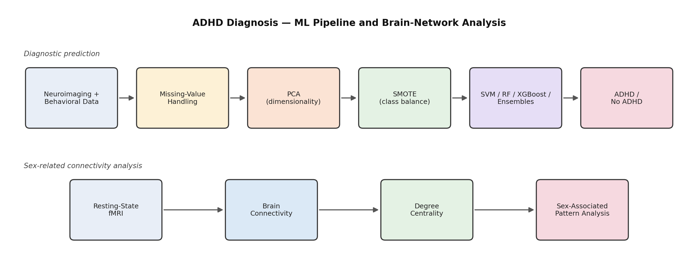

# 🧠 ADHD Diagnosis from Neuroimaging & Behavioral Data

Machine learning for ADHD classification using functional connectome and behavioral/demographic data, paired with a resting-state fMRI analysis of sex-related differences in brain-network patterns. **Top 10 global rank, WiDS Datathon 2025.** 🏆


---

## 📌 Overview

ADHD diagnosis leans heavily on behavioral and clinical assessment. This project asks whether machine learning can pick up on patterns in **functional connectome data** (brain-region connectivity derived from neuroimaging) combined with **quantitative and categorical metadata** to separate ADHD from non-ADHD participants, framed as a binary classification problem.

The work has two threads. The first is diagnostic prediction: high-dimensional preprocessing, dimensionality reduction, class-imbalance handling, and a comparison of many classifiers. The second is neuroscience-oriented: a degree-centrality analysis of resting-state fMRI from 82 adult patients, examining how ADHD-related connectivity patterns differ between sexes.

<p align="center">
  
</p>

## 📂 Dataset

Built on the **WiDS Datathon 2025** dataset, which includes:

- Quantitative metadata
- Categorical metadata
- Functional connectome data
- Target labels (ADHD outcome, biological sex)

**Source:** [kaggle.com/competitions/widsdatathon2025/data](https://www.kaggle.com/competitions/widsdatathon2025/data)

Raw and processed data files aren't included in this repo due to size — download from the link above and place under `data/raw/`.

## 🔄 Project workflow

```
Raw Dataset (Connectome + Metadata)
              ↓
   Data Cleaning & Preprocessing
              ↓
      Missing-Value Handling
              ↓
  PCA (Dimensionality Reduction)
              ↓
     SMOTE (Class Balancing)
              ↓
   Model Training & Evaluation
              ↓
         ADHD Prediction
```

```
       Resting-State fMRI
              ↓
Functional Connectome (Brain Connectivity)
              ↓
        Degree Centrality
              ↓
  Sex-Associated Pattern Analysis
```

## 🧬 How it works

1. **Data** — functional connectome features from neuroimaging alongside quantitative and categorical metadata, so the model isn't a pure "MRI → ADHD" classifier.
2. **Preprocessing** — missing-value handling and feature processing to make a high-dimensional, messy dataset usable.
3. **PCA** — compresses many correlated connectivity features into a smaller set of principal components, cutting redundancy, compute cost, and overfitting risk.
4. **SMOTE** — generates synthetic minority-class samples so the classifiers aren't biased toward the majority class.
5. **Modeling** — a broad comparison of classifiers, with SVM, Random Forest, and XGBoost among the stronger performers.
6. **Brain-network analysis** — resting-state fMRI treated as a network of regions; degree centrality measures how strongly connected each region is, and is compared across sexes.

## 🤖 Models evaluated

| Family | Models |
|---|---|
| Classical ML | Logistic Regression, SVM, Naive Bayes, KNN, Decision Tree |
| Ensemble / boosting | Random Forest, XGBoost, LightGBM, AdaBoost |
| Combined | Voting ensemble across multiple models |

Trying many model types was deliberate: it shows which kind of classifier captures the structure in this data best, instead of betting on a single algorithm.

## 📐 Evaluation

Given the class imbalance in ADHD outcome labels, evaluation leaned on **Recall**, **F1 Score**, and **ROC-AUC** rather than raw accuracy, which can be misleading on imbalanced classes.

## 🧪 Sex-sensitive analysis

Beyond "can we predict ADHD?", the project examines whether connectivity patterns associated with ADHD differ across sexes. Using resting-state fMRI from **82 adult patients**, each brain region is treated as a node in a network and its degree centrality (how strongly it connects to the rest of the network) is compared between groups. A model that ignores these population differences risks missing meaningful patterns.

## ⚠️ Scope

This is a research and competition project, not a clinical diagnostic tool. Results reflect the datathon dataset and haven't been validated in a clinical setting.

## 🎯 Applications

- Research into neuroimaging-based ADHD classification and feature selection for high-dimensional connectome data
- Studying sex-related differences in brain connectivity to inform more population-aware models
- A reference pipeline for imbalanced, high-dimensional biomedical classification (PCA + SMOTE + ensemble comparison)

## 🛠️ Tech stack

`Python` · `scikit-learn` · `XGBoost` · `LightGBM` · `imbalanced-learn (SMOTE)` · `NumPy` · `Pandas`

## 📁 Repo structure

```
├── data/
│   ├── raw/                             # place downloaded WiDS 2025 files here
│   └── processed/
├── notebooks/
│   └── adhd_diagnosis.ipynb            # preprocessing, PCA, SMOTE, model comparison
├── assets/
│   └── pipeline_diagram.png
├── requirements.txt
└── README.md
```

## 👤 Author

**Aniket Patil**
CS (AI) undergraduate, KLE Technological University
